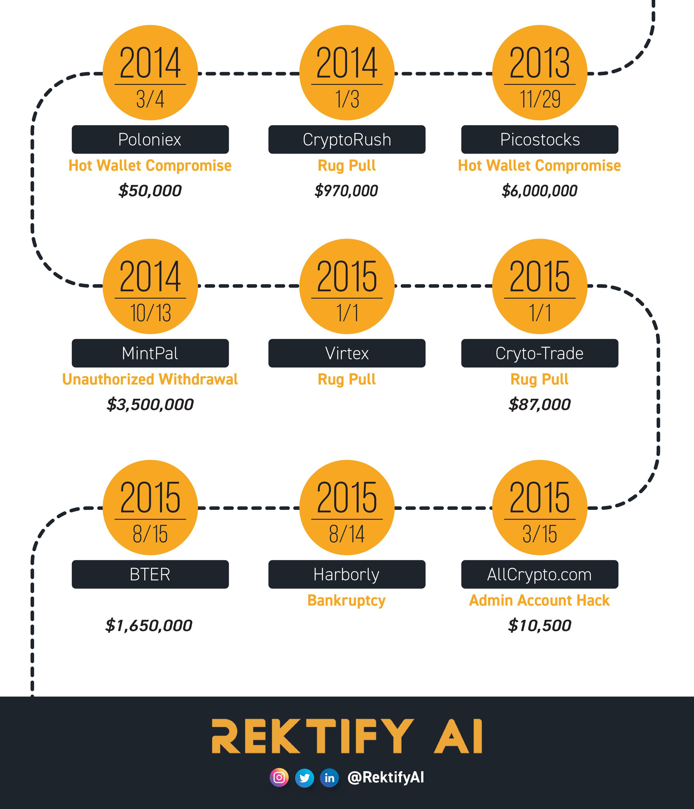
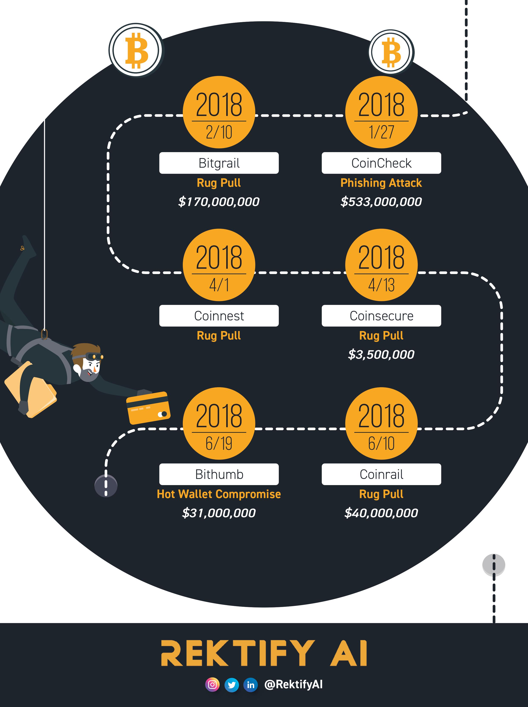
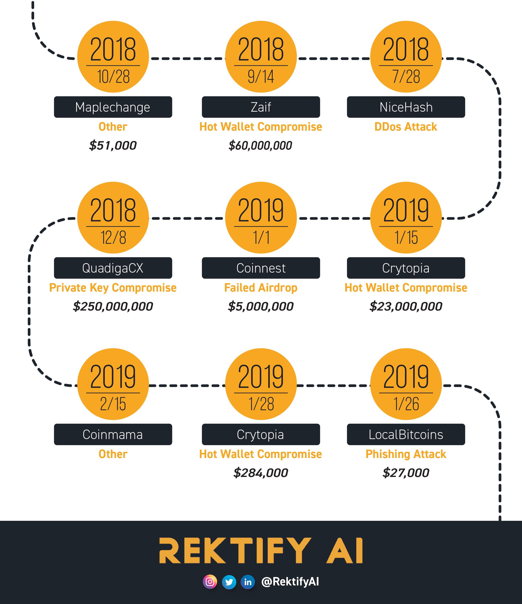
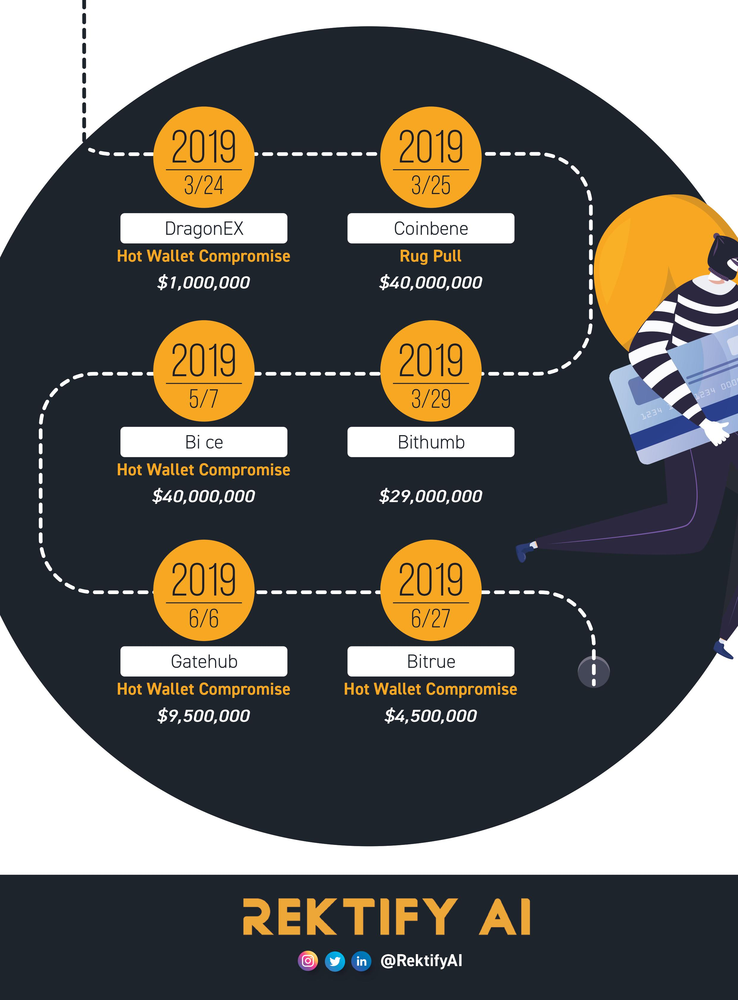

# Let's practice safe CEX
Repository of centralized exchange(CEX) failures, malfunctions, bankruptcies and scams. CEX collapses are not new to the blockchain industry.

<b> History </b>
<!-- image -->

  

<!-- image -->

  

<!-- image -->

  

<!-- image -->

  

<!-- image -->

  

<!-- image -->

  

<!-- image -->

  

<!-- image -->

  

<!-- image -->

  

<!-- image -->

  

<!-- image -->

  

